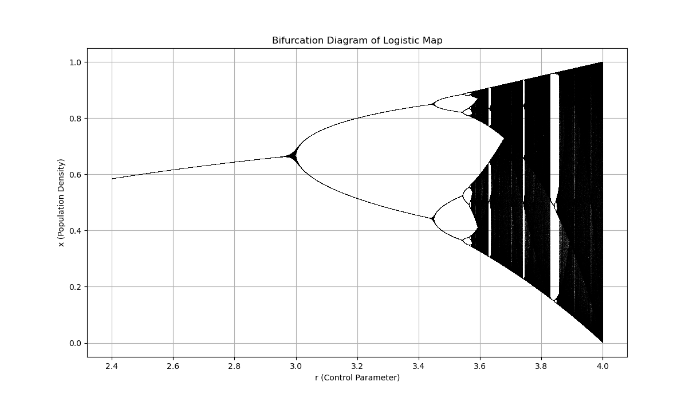
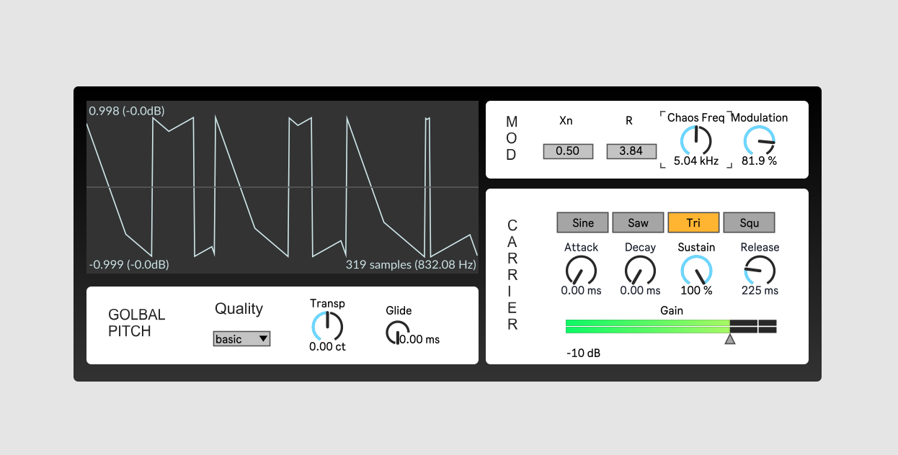

# Chaotic Algorithm for FM Synthesis

This project uses the **Logistic Map** (also known as the **Logistic Equation**) to generate a waveform for modulating an **FM synthesizer** in MAX MSP. The Logistic Map is a simple, non-linear iterative system that exhibits a wide range of behaviors, including stable points, periodic oscillations, and chaotic dynamics. This unpredictability makes it an interesting tool for generating modulating signals that add complexity and randomness to FM synthesis.

## Logistic Map Principles

The **Logistic Map** is a one-dimensional recurrence relation defined by the equation:

$$
x_{n+1} = r \cdot x_n \cdot (1 - x_n)
$$
Where:

- $  x_{n} $ is the state of the system at iteration \( n \)
- $\ r $ is a control parameter that determines the system's behavior (e.g., stability, periodicity, chaos),
- $\ x_{n+1}$ is the next state of the system.

Similar to the idea of feedback FM, we can translate the output of the algorithm to waveform and use it to modulate the frequency of a basic shape carrier, adding controllable unpredictability and dynamics.

### Key Behaviors of the Logistic Map:

- **Stable Points**: When$\ r $ is low (typically$\ r $), the system converges to a single point (either $  x_{n} = 0 $ or $  x_{n} = 1 $).

- **Periodic Oscillations**: For certain values of $\ r $  (between 3 and 3.57), the system starts to exhibit periodic oscillations. For example, it may alternate between two values, then four, eight, etc.

- **Chaos**: When $\ r $  is greater than 3.57, the system exhibits chaotic behavior, where tiny changes in initial conditions lead to drastically different outcomes. This behavior is what makes the Logistic Map ideal for generating unpredictable waveforms. In a random system, sound generated each time differs, with that comes nothing but uncertainty. But in a chaotic system, we start off at a certain state,  as parameters changes over time the system generates more randomness. Finding the boundaries between chaos and order through experiments can result in very interesting sounds.

  

## Parameters

Playing with these parameters to discover sounds:

### Mod

**1. ** Set initial value of $  x_{n} $ and $  r $ to reach find critical points of chaos. 

- **Stable region**: $r \in [2.8, 3.0]$
- **Periodic oscillation region**: $r \in [3.0, 3.57]$
- **Chaos region**: $r \in [3.57, 4.0]$ , in this state little changes happen to $  x_{n} $ can result in great changes.
- **Beyond $r = 4.0$**: not used, as the logistic function becomes invalid. 

**2. ** Modulation

- Change Chaos Freq : central frequency of the generated waveform.
- Modulation: amount of modulation on carrier.

Feel free to change the range of knobs to get more possibilities.

### Carrier

- Basic Shapes
- ADSR
- Output level

### Pitch Shift

Shift the global pitch in situations where tonal characteristics are needed.

## To be added

- polyphonic voices
- more modulators
- wavetable for carrier